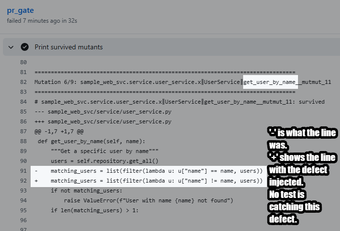

# PythonMutationTestingSandbox

Sample repo showing how to enforce mutation testing threshold gates on pull requests

## Setup
 
```bash
# Install dependencies
pip install -r requirements.txt
```

## Running unit tests

```bash
# Run all tests
python -m pytest tests/
```

## Running web server
```bash
# Run the application
python app.py
```

## Testing the API

- `GET /users` - Get all users
- `GET /users/<id>` - Get user by ID
- `POST /users` - Create new user (JSON: {name, email})
- `GET /health` - Health check

From a browser, navigate to, for example, http://localhost:5000/users

## Self-guided tutorial to observe how the mutation testing gate works
Let's say we want to enhance our project by adding the ability to find a user by their name. For educational purposes, we will add it to our service class instead.

Inside service/user_service.py, add this method:
```
    def get_user_by_name(self, name):
        """Get a specific user by name"""
        users = self.repository.get_all()
        matching_users = list(filter(lambda u: u["name"] == name, users))
        if not matching_users:
            raise ValueError(f"User with name {name} not found")
        if len(matching_users) > 1:
            raise ValueError(f"Multiple users with name {name} found")
        return matching_users[0]
```

Inside tests/test_user_service.py, add a new test method that does not properly assert on the result:
```
    def test_get_user_by_name_found(self):
        self.mock_repo.get_all.return_value = [
            {"id": 1, "name": "Alice", "email": "alice@example.com"},
            {"id": 2, "name": "Bob", "email": "bob@example.com"}
        ]
        user = self.service.get_user_by_name("Alice")
```

Create a pull request. The mutation testing gate should fail with an error about the mutation score being below the threshold.

View the pull request logs.  You should see all of the mutations that were injected and uncaught by tests.


If you scroll down, you can see some mutants injected for your new method.


Now let's improve the test we added by adding some asserts.
```
    def test_get_user_by_name_found(self):
        self.mock_repo.get_all.return_value = [
            {"id": 1, "name": "Alice", "email": "alice@example.com"},
            {"id": 2, "name": "Bob", "email": "bob@example.com"}
        ]
        user = self.service.get_user_by_name("Alice")
        self.assertEqual(user["name"], "Alice")
        self.assertEqual(user["id"], 1)
        self.mock_repo.get_all.assert_called_once()
```

Push these changes to your branch.  Your pull request should now pass the gate.
